**Task**
Re-draw the following diagram using Pencil and the TAM Block diagram shape collection.

Target diagram to draw in this tutorial

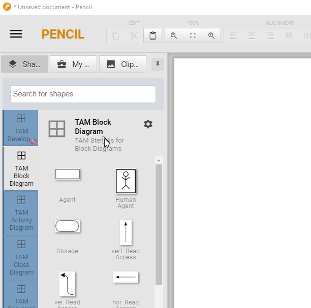

We start with a new blank document, the TAM Block Diagram collection is visible on the left.

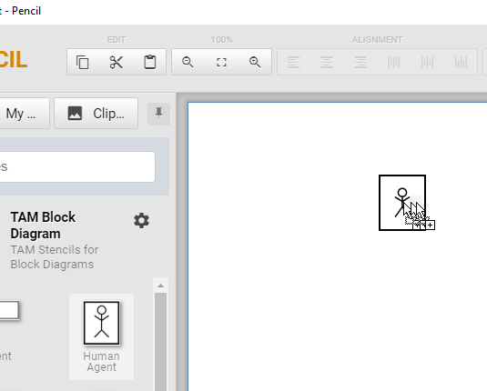

<figcaption>From there, we can drag a Human Agent and drop it on the drawing.</figcaption>

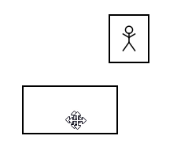

<figcaption>Do the same for a normal Agent shape and put it below the Human Agent.</figcaption>

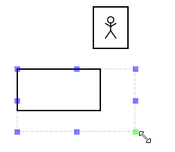

<figcaption>Resize it with the shape handles.</figcaption>

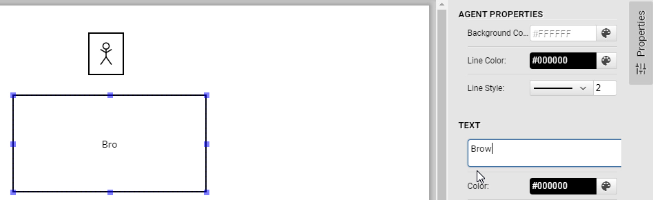

<figcaption>Add Text "Browser" using the Text property field on the right.</figcaption>

<figcaption>Align the text at the top using the alignment property button</figcaption>

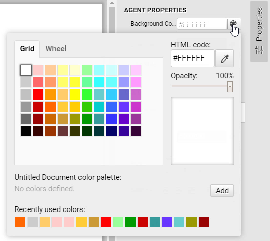
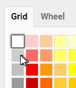

<figcaption>Then set the background color (Fill color) to light gray.</figcaption>

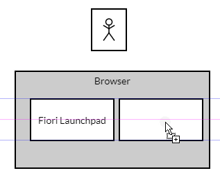

<figcaption>Now we need two agents inside the Browser. The left one is the Fiori Launchpad,</figcaption>

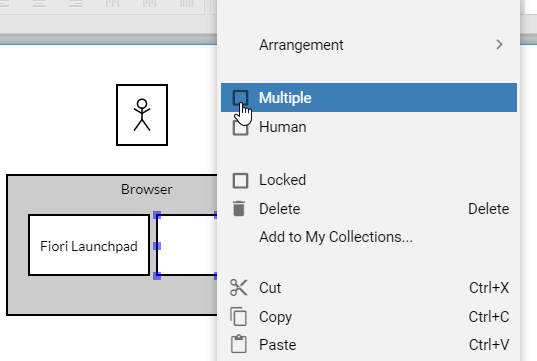

<figcaption>The right one are UI5 Applications. We need it stacked, so from context menu select "Multiple".</figcaption>

To enter text, you can also double click the shape and enter text in place. Type "UI5 Applications".

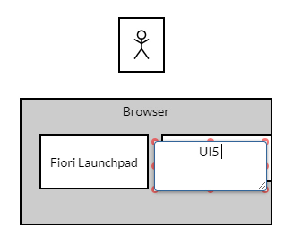

<figcaption>When you enter text in place after a double click, the text is always displayed aligned at the top, regardless of the actual alignment in the shape.</figcaption>

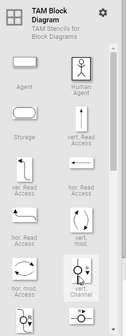

<figcaption>Now we need a simple channel between human agent and Browser, but the  standard channel has already a Request-Response annotation.</figcaption>

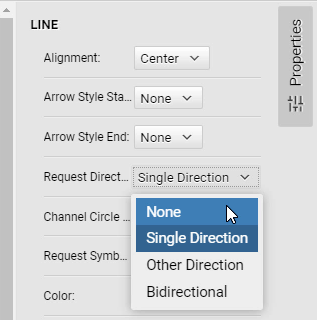

<figcaption>To get rid of this, choose "Request Direction - None" in the properties.</figcaption>

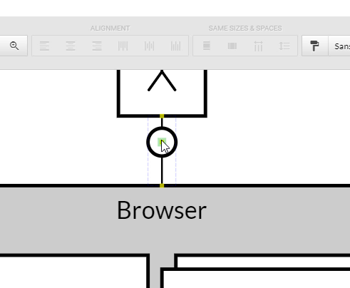
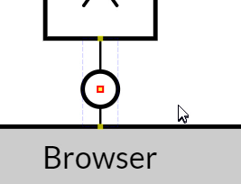

<figcaption>Zoom (CTRL+Mousewheel) in to position the channel circle more precisely.</figcaption>

<figcaption>The next shape is the Service Proxy agent.</figcaption>

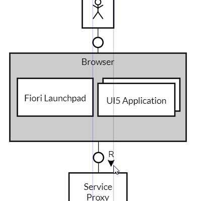

<figcaption>Add a channel to connect Browser to Service Proxy</figcaption>

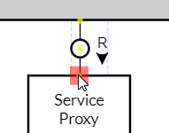

<figcaption>Don't forget to glue the lines to the connection points of the agents. They are highlighted in red when glueing.</figcaption>

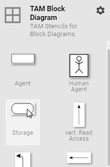
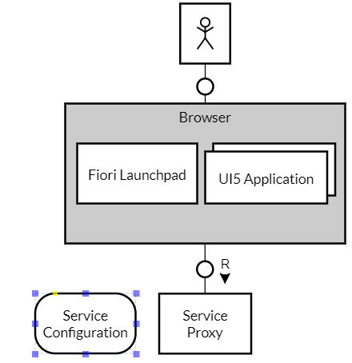

<figcaption>Now we need a storage for the Service Configuration at the left side of Service Proxy.</figcaption>

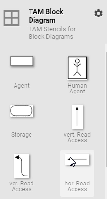
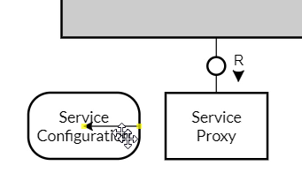

<figcaption>Now we need a read-only access arrow (from storage to agent), but the "hor. Read Access" shape points in the opposite direction.</figcaption>

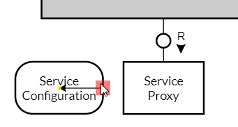
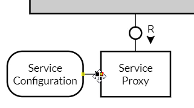

<figcaption>Connect one side first, then turn the arrow by connecting it with the other side.</figcaption>

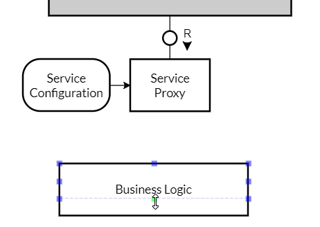

<figcaption>The next shape is the business logic agent below the Service Proxy. It should be wide and rather flat.</figcaption>

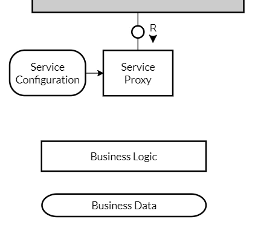

<figcaption>The Business Data Storage shape should have similar dimensions.</figcaption>

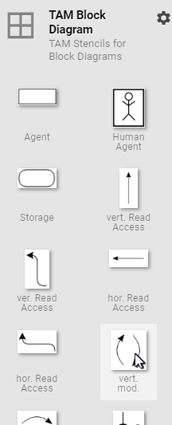
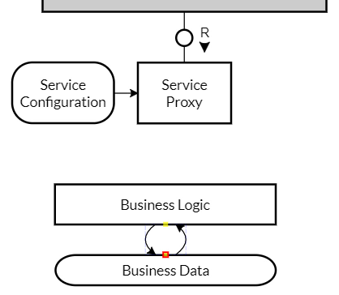

<figcaption>We need a vertical modifying Access (two curved arrows) between Business Logic and Business Data.</figcaption>

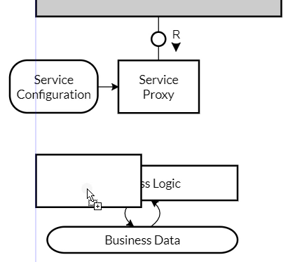

<figcaption>For multiple Backend Servers combining Business Logic and Business Data, we need a stacked agent shape again. Let's start with a normal agent.</figcaption>

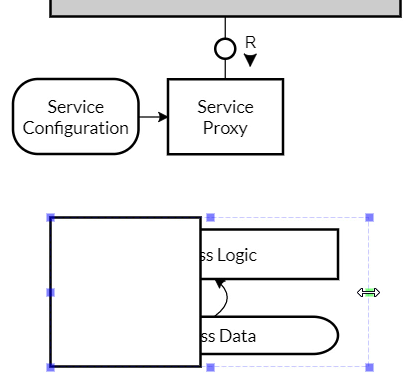
<figcaption>Resize it to cover both agent and storage.</figcaption>

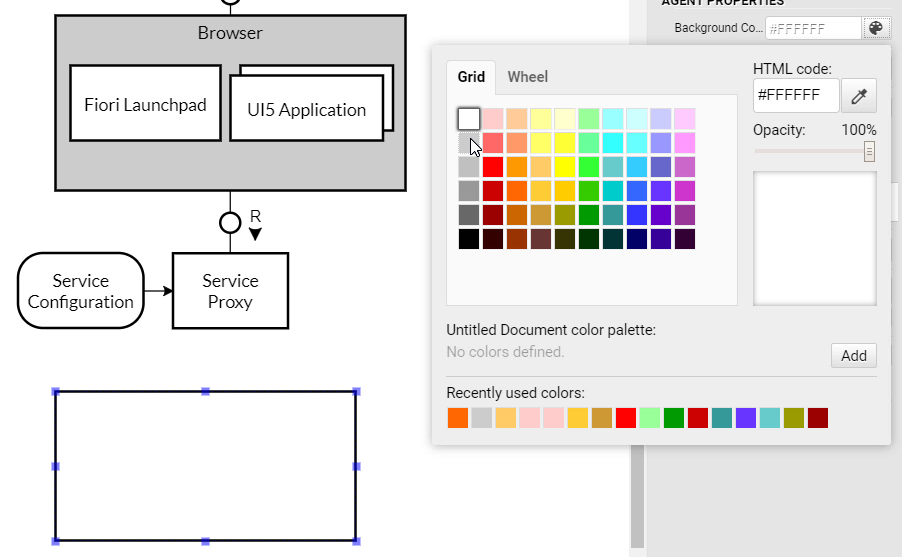

<figcaption>Set the fill color to light gray.</figcaption>

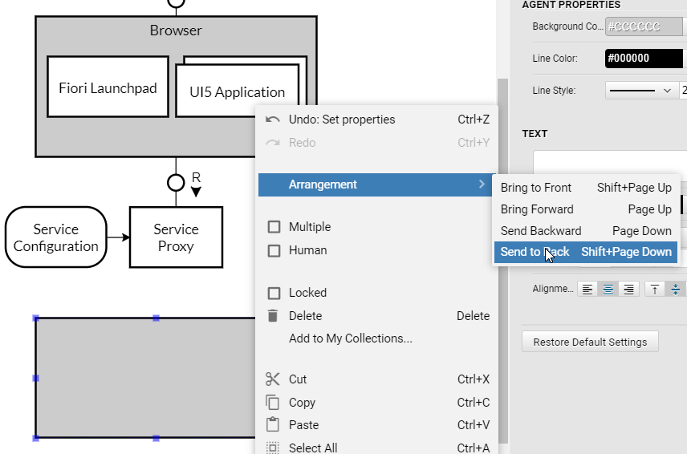

<figcaption>To see the inner agent and storage, we need to send the new shape to the back. From the context menu, select "Arrangement -> Send to Back".</figcaption>

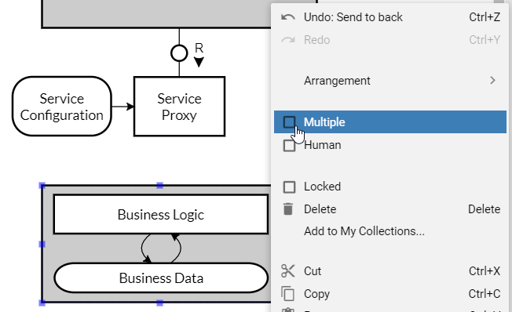
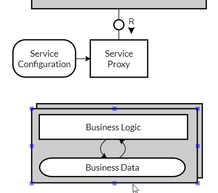

<figcaption>For the stacked shape, select "Multiple" from the context menu as well.</figcaption>

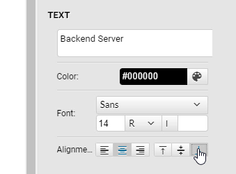
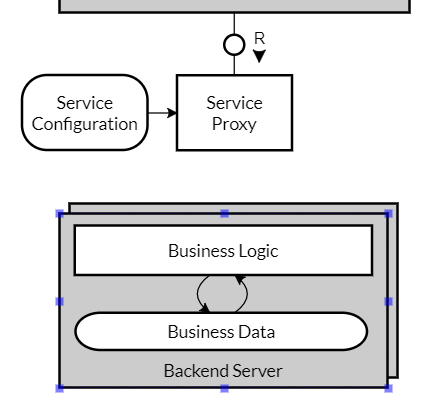

<figcaption>The "Backend Server" Label is still missing and needs some space; it should be aligned at the bottom.</figcaption>

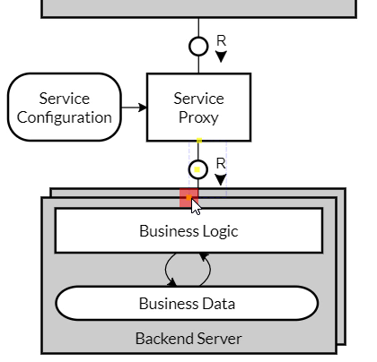

<figcaption>Another request-response channel connects the Backend Server with the Service Proxy.</figcaption>

(OK, in the target block diagram, the channel goes through to the Business Logic agent. Luckily, in this case, it has the same result.)

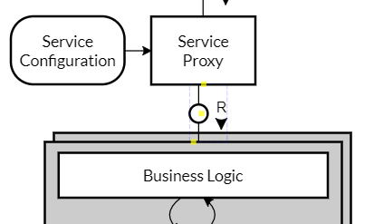
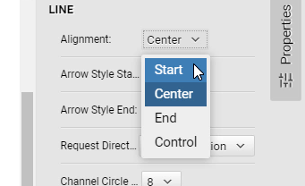
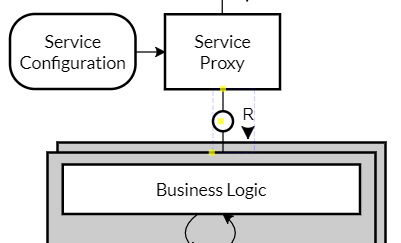

<figcaption>To align the channel to the Service Proxy, change "Alignment" from "Center" to "Start".</figcaption>

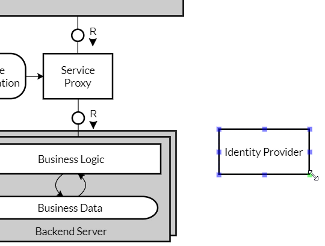

<figcaption>Let's move on with the Identity Provider on the right side.</figcaption>

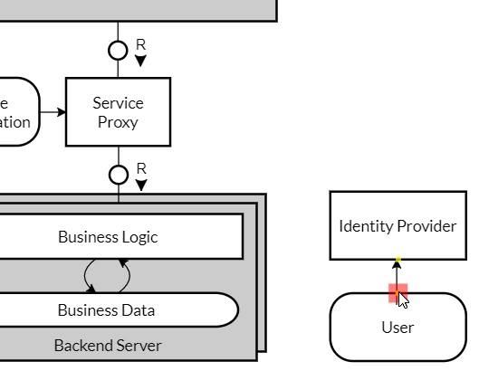

<figcaption>It has read only access to a User storage.</figcaption>

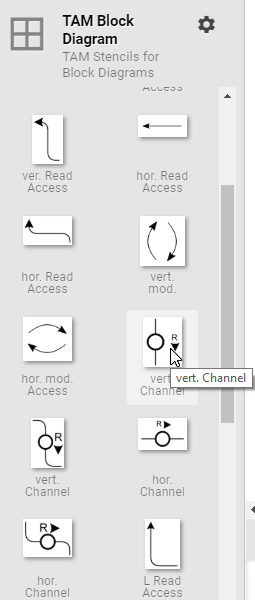
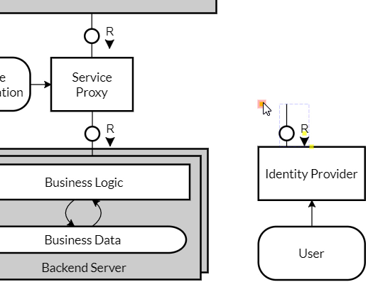

<figcaption>The channel with one corner / elbow is tricky - it is not available as individual shape. But you can change a vertical channel to what we need:</figcaption>

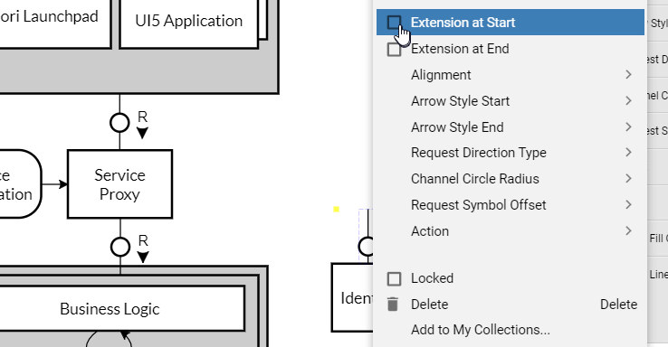
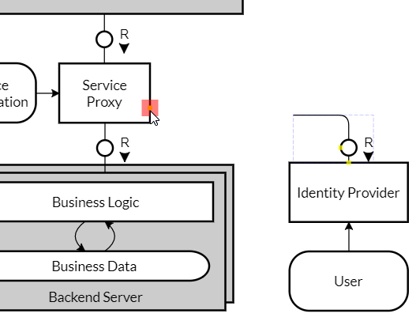

<figcaption>Via the context menu of the channel, select "Extension at Start", which adds the elbow.</figcaption>

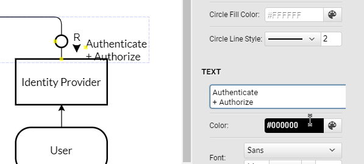

<figcaption>To enter a text with line breaks, you have to use the Text box in the Properties. Here, you can add or remove line breaks in the text.</figcaption>

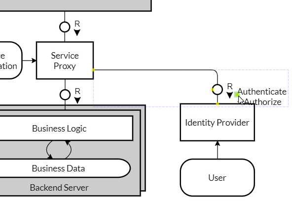
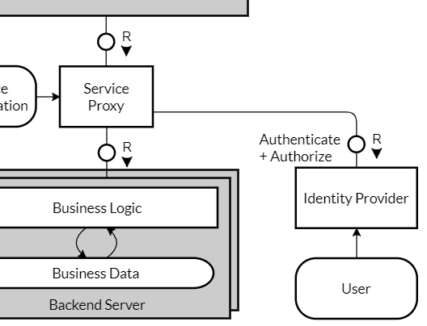

<figcaption>A yellow control point lets you re-position the text.</figcaption>

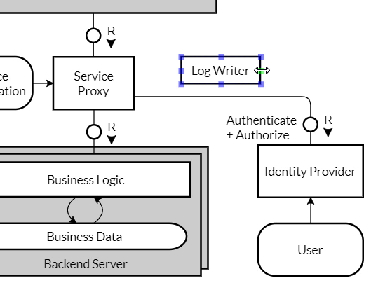

<figcaption>Now we need a very small agent "Log Writer". Resize vertically, then enter the text. Now you know how far you can resize horizontally.</figcaption>

<figcaption>For the Logs storage, it's similar. We need to align on the right as well.</figcaption>

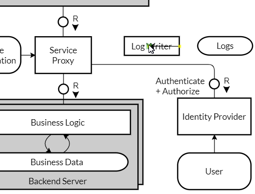
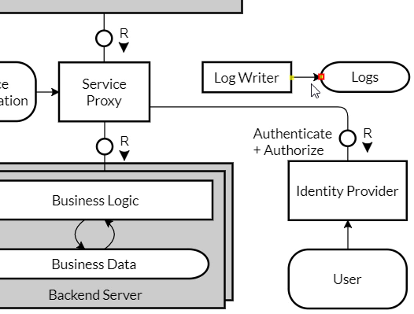

<figcaption>We need a write-only access arrow this time, so again we need to turn an existing one.</figcaption>

<figcaption>Finally, a unidirectional channel is required leading from Service Proxy to Log Writer. We start with a standard horizontal channel, set "Request Direction to "None",</figcaption>

<figcaption>and this time, set "Arrow Style End: Full". This means that at the end of the line(s), a full arrow will be drawn.</figcaption>

<figcaption>Add the text "Access Log" and place it accordingly.</figcaption>

<figcaption>That's it.</figcaption>
