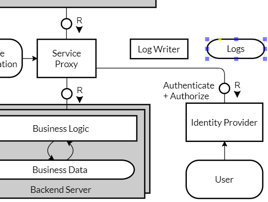

**Task**
Re-draw the following diagram using Pencil and the TAM Block diagram shape collection.

Target diagram to draw in this tutorial

We start with a new blank document, the TAM Block Diagram collection is visible on the left.

From there, we can drag a Human Agent and drop it on the drawing.

Do the same for a normal Agent shape and put it below the Human Agent.

Resize it with the shape handles.

Add Text "Browser" using the Text property field on the right.

Align the text at the top using the alignment property button

Then set the background color (Fill color) to light gray.

Now we need two agents inside the Browser. The left one is the Fiori Launchpad,

The right one are UI5 Applications. We need it stacked, so from context menu select "Multiple".

To enter text, you can also double click the shape and enter text in place. Type "UI5 Applications".

When you enter text in place after a double click, the text is always displayed aligned at the top, regardless of the actual alignment in the shape.

Now we need a simple channel between human agent and Browser, but the  standard channel has already a Request-Response annotation.

To get rid of this, choose "Request Direction - None" in the properties.

Zoom (CTRL+Mousewheel) in to position the channel circle more precisely.

The next shape is the Service Proxy agent.

Add a channel to connect Browser to Service Proxy

Don't forget to glue the lines to the connection points of the agents. They are highlighted in red when glueing.

Now we need a storage for the Service Configuration at the left side of Service Proxy.

Now we need a read-only access arrow (from storage to agent), but the "hor. Read Access" shape points in the opposite direction.

Connect one side first, then turn the arrow by connecting it with the other side.

The next shape is the business logic agent below the Service Proxy. It should be wide and rather flat.

The Business Data Storage shape should have similar dimensions.

We need a vertical modifying Access (two curved arrows) between Business Logic and Business Data.

For multiple Backend Servers combining Business Logic and Business Data, we need a stacked agent shape again. Let's start with a normal agent.

Resize it to cover both agent and storage.

Set the fill color to light gray.

To see the inner agent and storage, we need to send the new shape to the back. From the context menu, select "Arrangement -> Send to Back".

For the stacked shape, select "Multiple" from the context menu as well.

The "Backend Server" Label is still missing and needs some space; it should be aligned at the bottom.

Another request-response channel connects the Backend Server with the Service Proxy.

(OK, in the target block diagram, the channel goes through to the Business Logic agent. Luckily, in this case, it has the same result.)

To align the channel to the Service Proxy, change "Alignment" from "Center" to "Start".

Let's move on with the Identity Provider on the right side.

It has read only access to a User storage.

The channel with one corner / elbow is tricky - it is not available as individual shape. But you can change a vertical channel to what we need:

Via the context menu of the channel, select "Extension at Start", which adds the elbow.

To enter a text with line breaks, you have to use the Text box in the Properties. Here, you can add or remove line breaks in the text.

A yellow control point lets you re-position the text.

Now we need a very small agent "Log Writer". Resize vertically, then enter the text. Now you know how far you can resize horizontally.

For the Logs storage, it's similar. We need to align on the right as well.

We need a write-only access arrow this time, so again we need to turn an existing one.

Finally, a unidirectional channel is required leading from Service Proxy to Log Writer. We start with a standard horizontal channel, set "Request Direction to "None",

and this time, set "Arrow Style End: Full". This means that at the end of the line(s), a full arrow will be drawn.

Add the text "Access Log" and place it accordingly.

That's it.
