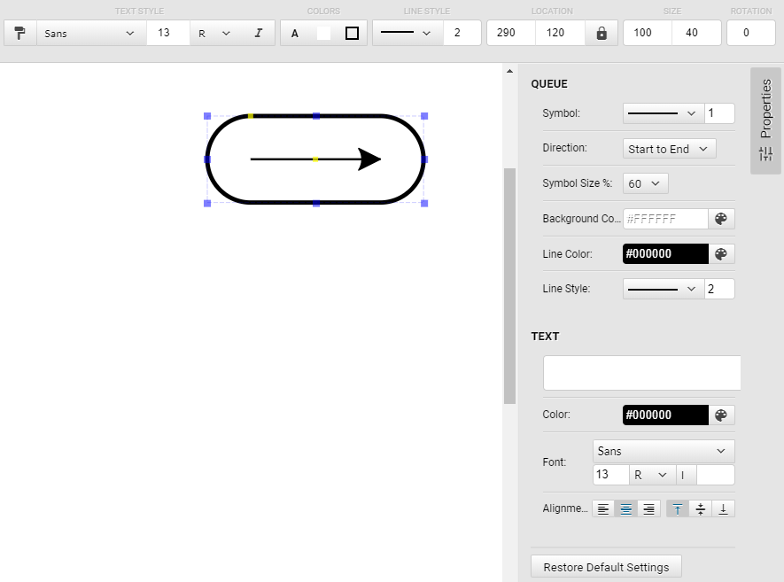

# Shape development
A pencil shape consists of the following parts:
* SVG markup in the section \<p:Content>; all SVG attributes which should be dynamic are left open.
* Properties (section \<Properties>) define the control elements for the use to change shape properties. The controls can be radio buttons in the context menu, dropdown lists (Enum), text fields, color / font picker, or shape handles.
* Section \<Behaviors> maps properties to SVG elements
* The section \<Actions> finally adds arbitrary scripts to the shape. A pre-defined action is a function to add glue points to the shape.

## Example: Queue Shape

Let's start with a simple shape for TAM block diagram: A queue. It's a storage with an arrow inside to depict the queue direction.

### SVG markup (\<p:Content>)

From a graphical perspective, we need:
* a rectangle shape with rounded corners for the storage symbol: \<rect>
* a line with arrowhead for the queue annotation: \<path>
* a text field for storage: \<text>

All elements require an identifier (id="") so that the Behaviours section can refer to them.

An implicit group \<g> markup will be added by Pencil, so that a shape is always a group of elements. Nevertheless, you can add subgroups as you want, and control them using the Properties (such as visibility as example)

The sequence of elements matters: They will be put on top of each other, which means, later elements will be placed on top of earlier ones.
Arrows on lines have to be defined as markers separately in a \<defs> section. The line is defined in a \<path> section and refers to the arrow definitions:

    <p:Content xmlns:p="http://www.evolus.vn/Namespace/Pencil"
               xmlns:sodipodi="http://sodipodi.sourceforge.net/DTD/sodipodi-0.dtd"
               xmlns="http://www.w3.org/2000/svg">
        <defs>
            <marker
               id="ArrowEnd"
               orient="auto"
               refY="0.0"
               refX="0.0"
               style="overflow:visible;">

               <path
                  id="ArrowEndPath"
                  transform="rotate(180) translate(1,0)"
                  style="fill-rule:evenodd;stroke-width:0.625;stroke-linejoin:round;stroke:#000000;stroke-opacity:1;fill:#000000;fill-opacity:1"
                  />
            </marker>
            <marker
               id="ArrowStart"
               orient="auto"
               refY="0.0"
               refX="0.0"
               style="overflow:visible;">

               <path
                  id="ArrowStartPath"
                  transform="translate(1,0)"
                  style="fill-rule:evenodd;stroke-width:0.625;stroke-linejoin:round;stroke:#000000;stroke-opacity:1;fill:#000000;fill-opacity:1"
                  />
            </marker>
         </defs>

        <rect id="rect" x="0" y="0" />
        <path
           id="line"
           style="stroke-linejoin: round; "
           fill="none"
           marker-start = "url(#ArrowStart)"
           marker-end   = "url(#ArrowEnd)"
            />
        <text id="text" text-anchor="start" xml:space="preserve" />
    </p:Content>

As you see, the arrowhead definitions (\<defs>, \<marker>) take most of the space. You can use regular SVG markup here and define all properties of SVG elements. On the other hand, you can leave most things open, such as in the \<rect> tag.

### Shape Properties (\<Properties>)

Properties are grouped with \<PropertyGroup>. For each property, there are three important things to specifiy independently from the kind of property:
* Property name (name=""): This is the identifier to refer to the content of the property in all sections using the $name syntax. Some property names are [given by the system](http://pencil.evolus.vn/wiki/ref/Special_names.html), such as "box" or "strokeColor". By the way, please only use alphanumeric characters as names; even hyphens "-" or underscores "_" will lead to strange behavior or even prevent the stencil from loading!
* Property type (type="") defines not only the [data type of a property](http://pencil.evolus.vn/wiki/ref/Data_Types.html), but also how the property can be entered / changed in the UI.
* The Property value is the initial value of the property.

Let's take a look a the \<Properties> section of the Queue shape:

    <Properties>
        <PropertyGroup name="Queue">
            <Property name="box" type="Dimension">100,40</Property>
            <Property name="HNDLqueueArrow" displayName="Queue Arrow" 
                p:minY="10" p:maxY="$box.h-10" p:lockX="true" p:expressionX="$box.w / 2"
                type="Handle">50,20</Property>
            <Property name="strokeStyleQueue" displayName="Queue Symbol" type="StrokeStyle"><E>$$defaultEdgeStrokeStyle</E></Property>
            <Property name="ENUMdirection" displayName="Queue Direction" 
                p:enumValues="['toEnd|Start to End', 'toStart|End to Start']"
                type="Enum">toEnd</Property>
            <Property name="ENUMqueueLength" displayName="Queue Symbol Size %" 
                p:enumValues="['40|40', '50|50', '60|60', '70|70', '80|80']"
                type="Enum">60</Property>
            <Property name="HNDLcornerRadius" displayName="Corner Radius" 
                p:minX="10" p:maxX="50" p:lockY="true" 
                type="Handle"><E>$$defaultCornerRadius + ",0"</E></Property>
            <Property name="fillColor" displayName="Background Color" type="Color"><E>$$defaultBackgroundColor</E></Property>
            <Property name="strokeColor" displayName="Line Color" type="Color"><E>$$defaultStrokeColor</E></Property>
            <Property name="strokeStyle" displayName="Line Style" type="StrokeStyle"><E>$$defaultNodeStrokeStyle</E></Property>
        </PropertyGroup>
        <PropertyGroup name="Text">
            <Property name="TTXTlabel" displayName="Label" p:editInfo="({targetName: 'text', bound: Bound.fromBox($box), font: $textFont, align: $ALGNtextAlignment, multi: true})" type="PlainText" />
            <Property name="textColor" displayName="Text Color" type="Color"><E>$$defaultTextColor</E></Property>
            <Property name="textFont" displayName="Font" type="Font"><E>$$defaultTextFont</E></Property>
            <Property name="ALGNtextAlignment" displayName="Text Alignment" type="Alignment">1,0</Property>
        </PropertyGroup>
    </Properties>

There are two Property Groups "Queue" and "Text" which are displayed with a separator:

If you have used [special property names](http://pencil.evolus.vn/wiki/ref/Special_names.html), handles and property fields will be activated as well:
* box: The blue object handles appear at the shape.
* strokeStlye: The Line Style controls work
* textColor, fillColor and strokeColor: The Colors controls work
* textFont for the Text Style Controls

Some properties refer to stencil-wide default values, for example the property strokeColor refers to the default line color defaultStrokeColor defined in src/includes/Properties.xml

Property Types
* __Handle__: Controlled by a yellow handle at the defined position, for example for the corner rounding or the position of the line with arrowhead. It is possible to [restrict the placement of the handle](http://pencil.evolus.vn/wiki/devguide/Tutorial/Dimension_and_Handle_constraints.html), as for "HNDLqueueArrow". In addtion, you can automatically set one dimension using p:expressionX="" or p:expressionY="". If you don't want the Handle to move when the shape is resized, add p:noScale="true". It is also possible to allow a handle to connect to a connection point of another shape with p:connectTo="*".
* __StrokeStyle__: Controls the line type and width using a drop-down menu for style and line width, in the example "strokeStyleQueue" (Symbol) and "strokeStyle" (Line Style)
* __Color__: Shows a color picker to change a color: "fillColor (Background Color)", "strokeColor (Line Color)", "textColor"
* __Enum__: Gives choices and an initial value: "ENUMdirection (Direction)" and "ENUMqueueLength (Symbol Size)"
* __Bool__: Displays a check box in the context menu (unfortunately not in the properties UI)

Disabling Properties

It is possible to disable properties using the disabled="true" parameter. In this case, no way control will be shown in the UI, but still the variable is set. This allows pre-sets for a shape when used with a Shortcut. Example: The Storage shape is a shortcut to the rounded rectangle shape where the corner rounding is fix - the control is disabled (see topic Shortcuts for more details).

You can disable properties dynamically depending on other properties as well. For example in the class shape, the text property fields of the compartments are disabled if the compartment is not enabled. 

### Behaviors: Apply properties to SVG elements

To actually control the graphical SVG elements with the properties defined above, the \<Behaviors> section contains the \<For> sections which refer to one SVG element each using the element id.

It depends on the type of the SVG element what you can change in a \<For> section. The [Pencil Behavior Reference](http://pencil.evolus.vn/wiki/ref/Behaviors.html) gives details. The most generic one is the \<Attr> section.

You refer to the properties using the $propertyName syntax. Properties are typically data structures. 
* If they contain a single value, the use $propertyName.value (it's a string by default)
* Dimensions have height and width: $box.h, $box.w
* Handles have x and y position: $HNDLqueueArrow.x, $HNDLqueueArrow.y
* Many Behaviors expect a data structure anyway, such as \<StrokeColor>

Some element behaviors apply to all SVG elements, such as [Visibility](http://pencil.evolus.vn/wiki/ref/Behaviors.html#visibility).

As you can see in the following example, you enter JavaScript code anyway.

    <Behaviors>
        <For ref="line">
            <D>[M($box.w*0.5*(1 - $ENUMqueueLength.value / 100), $HNDLqueueArrow.y),
                L($box.w*0.5*(1 + $ENUMqueueLength.value / 100), $HNDLqueueArrow.y)
                ]</D>

            <StrokeColor>$strokeColor</StrokeColor>
            <StrokeStyle>$strokeStyleQueue</StrokeStyle>
        </For>
        <For ref="ArrowStartPath">
            <Fill>$strokeColor</Fill>
            <StrokeColor>$strokeColor</StrokeColor>
            <D><![CDATA[
              var arrowHead = collection.arrowheadCreateSVG('full');
              arrowHead;
              ]]></D>
            <Visibility>$ENUMdirection.value == 'toStart'</Visibility>
        </For>
        <For ref="ArrowEndPath">
            <Fill>$strokeColor</Fill>
            <StrokeColor>$strokeColor</StrokeColor>
            <D><![CDATA[
              var arrowHead = collection.arrowheadCreateSVG('full');
              arrowHead;
              ]]></D>
            <Visibility>$ENUMdirection.value == 'toEnd'</Visibility>
        </For>
        <For ref="rect">
            <Box>$box</Box>
            <Fill>$fillColor</Fill>
            <StrokeColor>$strokeColor</StrokeColor>
            <StrokeStyle>$strokeStyle</StrokeStyle>
            <Radius>
                <Arg>$HNDLcornerRadius.x</Arg>
                <Arg>$HNDLcornerRadius.x</Arg>
            </Radius>
        </For>
        <For ref="text">
            <DomContent>F.buildTextWrapDomContent(F._target, $TTXTlabel.value, $box.w - $textFont.getPixelHeight(), $ALGNtextAlignment)</DomContent>
            $textFont
            <Fill>$textColor</Fill>
            <BoxFit>
                <Arg>new Bound(5, 5, $box.w - 10, $box.h - 10)</Arg>
                <Arg>$ALGNtextAlignment</Arg>
            </BoxFit>
        </For>
    </Behaviors>

#### JavaScript Functions
You can also use JavaScript functions which return a string. For example, the function arrowheadCreateSVG(type) creates SVG D commands to draw an arrowhead.  

#### Pitfalls
Since you enter JavaScript code in XML, there are some pitfalls you can run into:
* Logical AND: Using && in XML will not work or result in an error. You have to use \&amp;\&amp; instead!
* Strings everywhere: By default, all property .values are strings. JavaScript does a good job in automatically converting it, but sometimes it will not work as expected (2 + "60" = "260"). In this case, use something like parseFloat().

## Text Handling

There are two ways of using text in Pencil shapes: Plaintext and Rich text. In the TAM shapes, the Plaintext type is used.

The SVG markup (section \<p:Content>) is not much more than this:

    <text id="text" xml:space="preserve" />

Then you need a plaintext Property for the text, and you can adjust color, font and alignment as well:

    <Property name="TTXTlabel" displayName="Label" p:editInfo="({targetName: 'text', bound: Bound.fromBox($box), font: $textFont, align: $ALGNtextAlignment, multi: true})" type="PlainText" />
    <Property name="textColor" displayName="Text Color" type="Color"><E>$$defaultTextColor</E></Property>
    <Property name="textFont" displayName="Font" type="Font"><E>$$defaultTextFont</E></Property>
    <Property name="ALGNtextAlignment" displayName="Text Alignment" type="Alignment">1,0</Property>

Let's focus on the first property. The parameter p:editInfo="" controls the in-place text editor which you get when you double-click on the shape. By the way, you will notice that this edit field is not in sync with the text input field in the properties window on the right - only when the shape has been selected again.

Finally, look at the \<For> section in \<Behaviors>:

    <For ref="text">
        <DomContent>F.buildTextWrapDomContent(F._target, $TTXTlabel.value, $box.w - $textFont.getPixelHeight(), $ALGNtextAlignment)</DomContent>
        $textFont
        <Color>$textColor</Color>
        <BoxFit>
            <Arg>new Bound(5, 5, $box.w - 10, $box.h - 10)</Arg>
            <Arg>$ALGNtextAlignment</Arg>
        </BoxFit>
    </For>

[\<DomContent>](http://pencil.evolus.vn/wiki/ref/Behaviors.html#domcontent) "populates child DOM nodes into the target object" - in this case, \<tspan> nodes will be created, one per text line.

F.buildTextWrapDomContent() is a function that does the text wrapping of a text, a given alignment and text width to generate \<tspan> nodes with correct positioning. F._target is the pointer to the current DOM node (text).

[\<BoxFit>](http://pencil.evolus.vn/wiki/ref/Behaviors.html#boxfit) fits a text inside a given text boundary (bound), in this case inside the box with a 5 pixel margin on each side.

In case you don't have a box, but want to use a handle to position the text, you can use another approach:

    <For ref="text">
        <DomContent>F.buildTextWrapDomContent(F._target, $textContent.value, 300, $textAlignment)</DomContent>
        $textFont
        <Color>$textColor</Color>
        <Transform>[translate(parseFloat($textPos.x) - $textAlignment.h * 150, $textPos.y)]</Transform>
    </For>

The text width is 300 pixel, and the $textPos Handle property is used to position the text. The Alignment.h parameter controls via \<Transform> whether the text is positioned on the right side (left alignment, h=0), in the center (h=1), or on the left side (right alignment, h=2) of the control. 
Please note, if the text does not fill the 300 px, there will be no automatic text wrapping - this has to be done by hard line breaks.

## Shortcuts

A [Pencil Shortcut](http://pencil.evolus.vn/wiki/devguide/Tutorial/Shortcut.html) is a shape which just refers to an existing shape. It has an individual display name, icon, and an own set of initial values of the referenced shape. It is a powerful way to provide similar shapes with different defaults. 

When using shortcuts, please consider the following:
* You can only change the property _values_ of a shape. For example, you cannot change restriction such as p:lockX of a Handle, as it is no property value.
* Using properties with the disabled="true" parameter, you can set variables with a shortcut which are not visible in the UI.
* Collection: The definition of the referred shape must be loaded __before__ the shortcut, else you will encounter a load error of the collection.
* You will also run into load problems if a property name or type in the referred shape changes, but the shortcut uses the old one. So keep track of the dependencies!

### Hiding a Shape

If you add the parameter system="true" in the \<Shape ...> markup, it will be loaded, but not displayed in the collection. You can use Shortcuts to make it available nevertheless. 

This technique is used for generic shapes, such as in the Horizontal/Vertical line shape AllDHorVertLine_V002.xml, which is used for example in Activity Diagrams (ADFlowVertical_V002.xml) and Block Diagrams (BDAccessHorizontal_V002.xml).